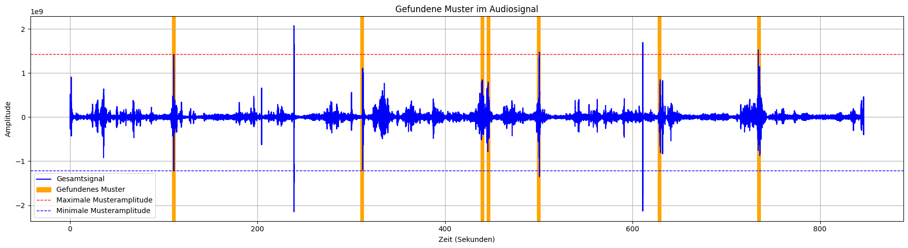
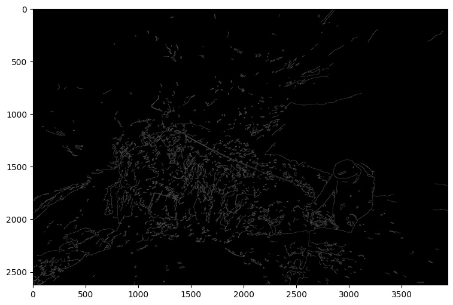
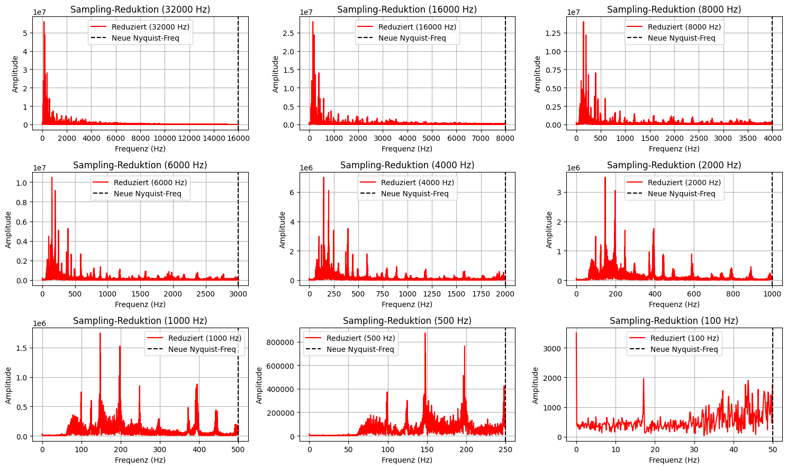
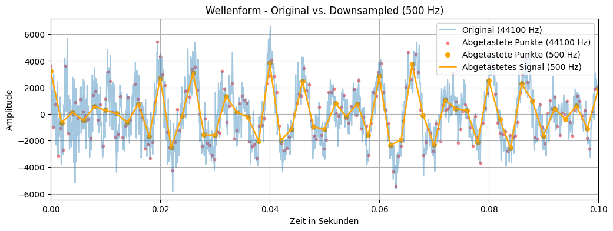

#  Projekt: Bild- und Signalverarbeitung

## Übersicht

Dieses Projekt behandelt grundlegende Konzepte der **Bild- und Signalverarbeitung** anhand von drei praxisnahen Aufgaben. Ziel war es, Methoden der digitalen Signalverarbeitung sowie der Bildanalyse zu verstehen, anzuwenden und deren Wirkung zu untersuchen.

---
Sources:
- Sound, "Birds_Austria_Waldviertel:": https://freesound.org/people/noctaro/sounds/240290/
- Image, "maja-kochanowska-YslVSKPZe0E-unsplash": https://unsplash.com/de/fotos/drei-personen-die-tagsuber-auf-dem-rock-mountain-klettern-YslVSKPZe0E
- Music, "S.T.S -Fürstenfeld": https://www.youtube.com/watch?v=FpRmP0XUVcA
---

## 🔊 Teil 1: Erkennung eines Vogelrufs in einer Audiodatei

**Ziel:**  
Automatische Erkennung eines bestimmten Vogelrufs innerhalb einer längeren Audiodatei mit diversen Vogelgeräuschen.

**Methode:**  
- Anwendung der **Autokorrelationsfunktion & Cross-Correlatiom** zur Lokalisierung des gesuchten Rufs im Audiosignal.

**Robustheitsanalyse:**  
Die Methode wurde unter Störbedingungen getestet:
- Hinzufügen von **weißem Rauschen**
- **Amplitude Scaling** (Veränderung der Signalstärke)

**Ergebnis:**  
Die Autokorrelationsmethode zeigte sich trotz Störungen als zuverlässig und effektiv zur Erkennung des gesuchten Vogelrufs.

---

## 🧍‍♂️ Teil 2: Bildverarbeitung – Kantenerkennung bei Kletterern

**Ausgangsbild:**  
Foto von drei Kletterern auf einem Klettersteig.

**Ziel:**  
Verbesserung der Sichtbarkeit des vordersten Kletterers durch Hervorhebung seiner Konturen.

**Methode:**  
- Einsatz der **Canny Edge Detection** mittels OpenCV sowie manuelle Implementation zur Kantenerkennung.
- Anschliessende Deconvolution und Evaluierung der Rekonstruktion

**Ergebnis:**  
Die relevanten Kanten des vordersten Kletterers wurden klarer hervorgehoben, wodurch er sich besser vom Hintergrund abhebt.

---

## 🎵 Teil 3: Abtasttheorem und Downsampling

**Thema:**  
Auseinandersetzung mit dem **Nyquist-Shannon-Abtasttheorem**.

**Vorgehen:**  
- Eine Audiodatei eines bekannten österreichischen Liedes wurde mit unterschiedlichen Faktoren **downsampled**.

**Analyse:**  
- Untersuchung der Auswirkungen auf die Tonqualität bei verschiedenen Abtastraten.

**Erkenntnisse:**  
- Bei Unterschreitung der **Nyquist-Frequenz** traten **Aliasing-Effekte** und hörbare Qualitätsverluste auf.  
- Dies verdeutlicht die Wichtigkeit einer ausreichenden Abtastrate bei der digitalen Signalverarbeitung.

